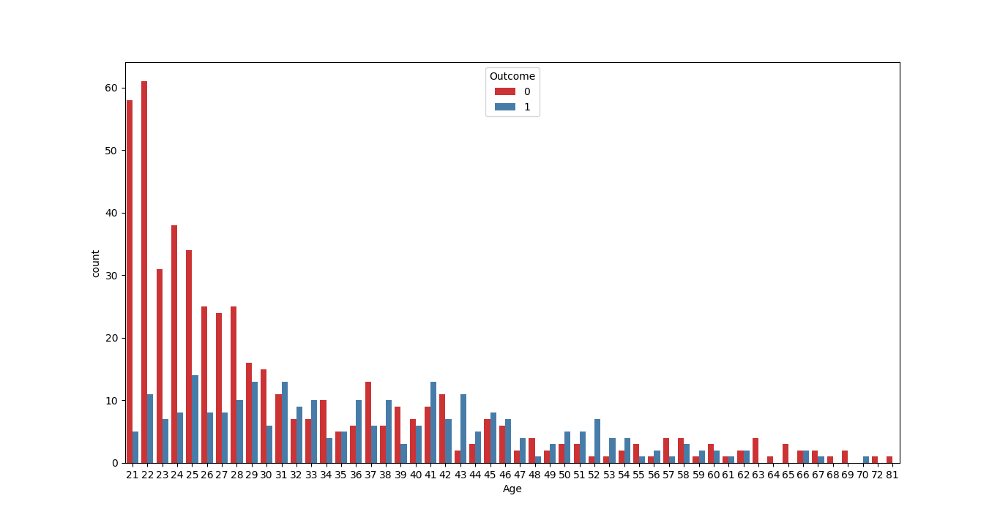
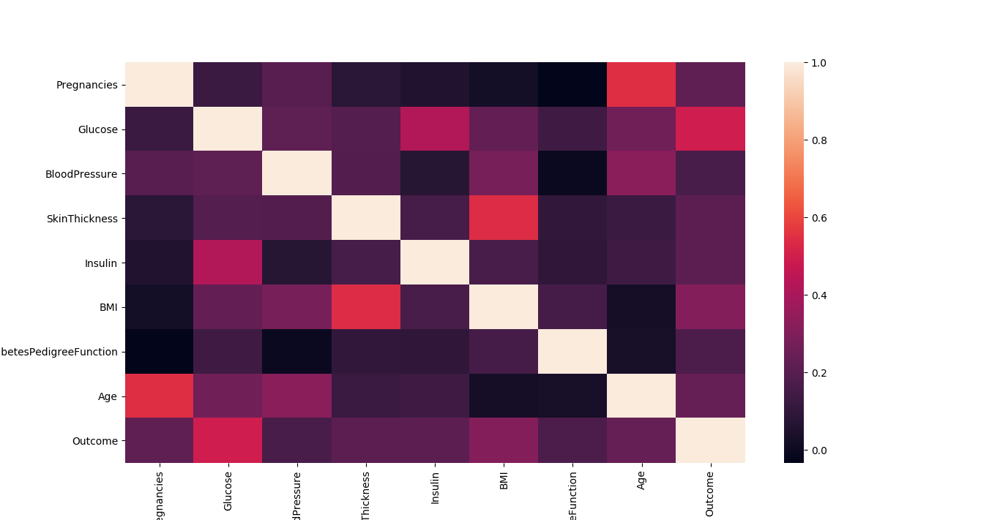

# diabetes prediction with K-NEAREST NEIGHBOR ALGORITHM

Using KNN Algorithm to predict if a person will have diabetes or not

## Visualizing data before processing

## F1_SCORE

0.6956521739130436

## Accuracy_SCORE

0.8181818181818182

